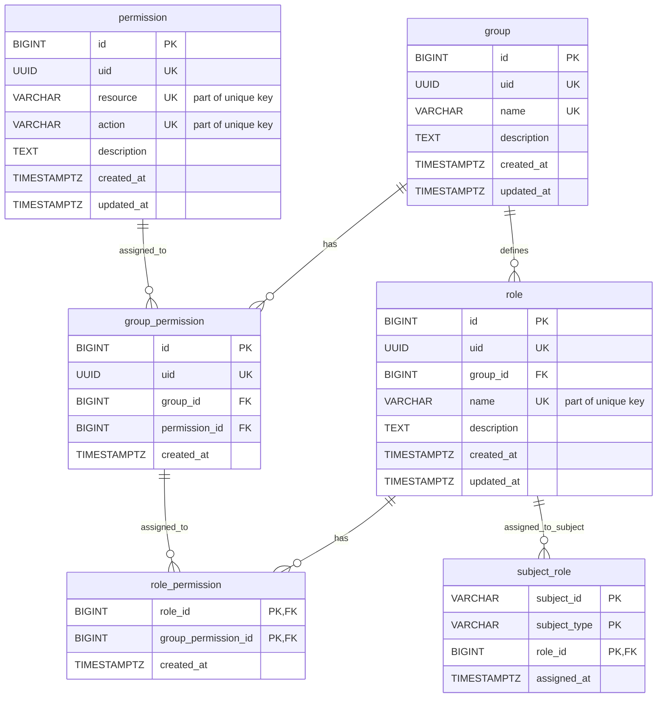

# Service Access Database

Database schema and migration source of truth for the Access Control domain.

## Table of Contents

- [Overview](#overview)
- [Database Schema](#database-schema)
- [Migration Structure](#migration-structure)
- [Environment Variables](#environment-variables)
- [Running Liquibase](#running-liquibase)
- [Migration Files](#migration-files)
- [Master Changelog](#master-changelog)
- [Usage](#usage)
- [Configuration](#configuration)
- [Testing](#testing)
- [Rollback Strategy](#rollback-strategy)
- [Success Criteria](#success-criteria)
- [Risks and Mitigations](#risks-and-mitigations)
- [Next Steps](#next-steps)

## Overview

This repository contains the database schema and migration scripts for the Service Access domain. It is used as the source of truth for the database schema and migration scripts.

## Database Schema



## Migration Structure

The migrations are managed via **Liquibase** and are located in the `changes/` directory.
The execution order is defined in `master.yml`.

| File                               | Description                                    | ID Prefix |
| :--------------------------------- | :--------------------------------------------- | :-------- |
| `001-create-permission-tables.yml` | Creates `permission` table.                    | `001-XX`  |
| `002-create-group-tables.yml`      | Creates `group` and `group_permission` tables. | `002-XX`  |
| `003-create-role-tables.yml`       | Creates `role` and `role_permission` tables.   | `003-XX`  |
| `004-create-subject-role.yml`      | Creates `subject_role` table.                  | `004-XX`  |

## Environment Variables

The following environment variables are required to run Liquibase (or provided via `.env`):

- `DATABASE_URL`: The URL of the database to connect to (e.g. `jdbc:postgresql://host:port/db`).
- `DATABASE_USER`: The username to use when connecting to the database.
- `DATABASE_PASSWORD`: The password to use when connecting to the database.

## Running Liquibase

You can use the provided `Makefile` or run via docker:

```bash
# Check status
make status

# Run update (apply migrations)
make update
```

## Migration Files

### Permission Migration (001)

- **File**: `001-create-permission-table.yaml`
- **Purpose**: Create permission table with resource-action pairs
- **Constraints**: Unique resource-action combination, UUID public ID

### Group Management Migration (002)

- **File**: `002-create-group-tables.yaml`
- **Purpose**: Create group and group_permission tables
- **Constraints**: Unique group names, cascade deletes on relationships, group_permission has own ID

### Role Management Migration (003)

- **File**: `003-create-role-tables.yaml`
- **Purpose**: Create role and role_permission tables
- **Constraints**: Unique role names within groups, cascade deletes, role_permission links role to group_permission

### Subject Assignment Migration (004)

- **File**: `004-create-subject-role.yaml`
- **Purpose**: Create subject_role assignment table
- **Constraints**: Composite primary key (subject_id, subject_type, role_id), cascade deletes

## Master Changelog

- **File**: `master.yml`
- **Purpose**: Include all migration files in execution order
- **Order**: 001 → 002 → 003 → 004 (business logic progression)

## Usage

### Apply All Migrations

```bash
liquibase --changeLogFile=master.yml update
```

### Validate Migrations

```bash
liquibase --changeLogFile=master.yml validate
```

### Rollback Last Migration

```bash
liquibase --changeLogFile=master.yml rollbackCount 1
```

### Rollback to Specific Version

```bash
liquibase --changeLogFile=master.yml rollback 20250213-001
```

## Configuration

### Database Connection

Update `liquibase.properties` with your database connection details:

```properties
url=jdbc:postgresql://localhost:5432/service_access
username=your_username
password=your_password
driver=org.postgresql.Driver
```

### Liquibase Properties

```properties
changeLogFile=master.yml
url=jdbc:postgresql://localhost:5432/service_access
driver=org.postgresql.Driver
username=service_access
password=your_password
verbose=true
contexts=dev,test,prod
```

## Testing

### Migration Validation

```bash
liquibase --changeLogFile=master.yml validate
```

### Data Integrity Tests

- Test foreign key constraints
- Verify cascade delete behavior
- Validate unique constraints

### Performance Tests

- Test index effectiveness
- Validate query performance
- Monitor execution plans

## Rollback Strategy

### Automatic Rollback

Each migration includes rollback statements that:

- Drop tables in reverse dependency order
- Preserve data integrity through CASCADE constraints
- Maintain referential integrity

### Manual Rollback

```bash
# Rollback all migrations
liquibase --changeLogFile=master.yml rollbackToDate 2026-02-13

# Rollback to specific version
liquibase --changeLogFile=master.yml rollback 20250213-001

# Rollback specific number of changes
liquibase --changeLogFile=master.yml rollbackCount 2
```

## Success Criteria

### Functional Requirements

- All tables created with proper constraints
- Foreign key relationships established
- Indexes created for performance optimization
- Business rules enforced through constraints

### Non-Functional Requirements

- Migration execution time < 5 minutes
- Data integrity maintained throughout
- Performance requirements met
- Rollback capability preserved

## Risks and Mitigations

### Risks

- Migration complexity with cascade deletes
- Performance impact during migration execution
- Data integrity during migration process

### Mitigations

- Comprehensive testing strategy
- Performance benchmarking
- Rollback capability
- Migration execution monitoring

## Next Steps

1. Configure database connection in `liquibase.properties`
2. Test migrations in development environment
3. Validate data integrity and performance
4. Deploy to production with proper monitoring
5. Monitor migration execution and performance

---

**Migration Status**: Complete
**Date**: 2026-02-13
